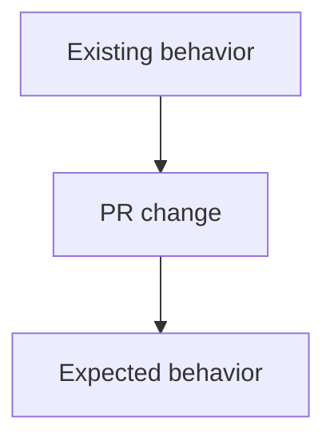

# AGENTS.md

Jekyll site using the Chirpy theme. Keep work small, issue-driven, locally verified, and reviewable.

## Non-negotiable workflow

1. Sync `master` before starting any task:
   ```bash
   git fetch origin
   git switch master
   git pull --ff-only origin master
   ```
2. Never edit, commit, push, force-push, or merge directly on `master`.
3. Create a separate branch from the updated `master`:
   ```bash
   git switch -c <type>/<short-name>
   ```
4. Make only the requested changes. Avoid unrelated cleanup or refactoring.
5. Perform basic local verification before committing.
6. Do not commit if local verification fails.
7. Ask the user to verify the local result manually.
8. Do not commit, push, or create a PR until the user confirms manual verification.
9. After approval, commit on the working branch, push it, and open a PR targeting `master`.
10. Never merge a PR unless the user explicitly requests it.
11. Never close a GitHub issue. The user closes issues after verification.

## GitHub references

- Reference relevant issues in commit messages and PR descriptions, for example: `Refs #16`.
- Do not use `Fixes`, `Closes`, or `Resolves`; these can close issues automatically.
- Preserve issue links, requirements, and acceptance criteria.

## Repository map

- Blog posts: `_posts/`
- Sidebar tabs/pages: `_tabs/`
- Other pages: `pages/`
- Theme data and social links: `_data/`
- Small theme overrides: `_includes/`
- Layout overrides: `_layouts/`
- Site configuration: `_config.yml`
- Images and static assets: `assets/`
- Chirpy JavaScript runtime bundles: `assets/js/dist/`

Use the smallest supported configuration or local override. Never edit files inside the installed Chirpy gem.

## Content model and editing

- Put dated articles in `_posts/` with valid YAML front matter.
- Put sidebar navigation pages in `_tabs/`; do not create duplicate home routes or tabs.
- Use `pages/` for standalone pages that should not automatically become sidebar tabs.
- Prefer global configuration in `_config.yml` or `_data/` over repeating values in every post.
- Use repository-relative asset paths and Jekyll URL filters where required.
- Preserve existing permalinks unless a route change is explicitly requested.

## Chirpy runtime assets

- Treat `assets/js/dist/` as runtime/generated output unless the repository workflow explicitly requires tracked bundle changes.
- Prefer editing the corresponding source or smallest local override.
- Do not copy a full theme layout for a small change when an include, data file, or configuration option works.
- Do not add a second implementation when Chirpy already provides the feature.

## Local verification

Use the repository's actual commands. For a production-equivalent Jekyll check:

```bash
bundle install
rm -rf .tmp/site
JEKYLL_ENV=production bundle exec jekyll build \
  --config _config.yml \
  --destination .tmp/site
python3 -m http.server 4000 --directory .tmp/site
```

Verify only what is relevant, but include at least:

- **Content:** front matter, headings, links, images, code fences, and Mermaid rendering.
- **UI:** affected flow, desktop/mobile layout, light/dark/system themes, keyboard access, and browser console.
- **Config/workflow:** production build, generated output, expected scripts/tags, and duplicate prevention.
- **Routes:** `/`, the affected page, and `/about/`, `/contact/`, tag/category routes when relevant.

A successful build is not enough for UI or runtime work. Verify the rendered behavior in a browser.

## Known repository pitfalls

- Restart Jekyll after `_config.yml` changes.
- Use `JEKYLL_ENV=production` for production-only features such as Analytics.
- Mermaid posts need `mermaid: true`; use literal `-->`, not `--&gt;`.
- Respect `url`, `baseurl`, `relative_url`, and `absolute_url` when building links.
- Do not edit installed gem files.
- Avoid duplicate routes, tabs, Analytics tags, scripts, listeners, or generated UI.
- Do not claim production, GA Realtime, SEO, or deployment verification from a local build alone.

## Temporary files

- Put builds, logs, screenshots, drafts, and diagnostics under `.tmp/`.
- Never commit `.tmp/`, `_site/`, caches, logs, credentials, secrets, or unrelated generated files.
- Do not expose passwords, tokens, service-account keys, OAuth secrets, or API secrets.

## Commits

Before committing:

1. Confirm local checks pass.
2. Confirm the user manually verified the change.
3. Run:
   ```bash
   git status --short
   git diff --check
   git diff
   ```
4. Stage only intended files; do not use `git add .`.
5. Include the issue reference, for example:
   ```text
   feat: add reading progress bar

   Refs #16
   ```

## Pull requests

Every PR must target `master` and include:

1. Relevant issue links using `Refs #<number>`.
2. Concise summary of what changed.
3. Local verification performed.
4. User manual-verification status.
5. Risks, limitations, and follow-up work.
6. Files or areas changed when useful.
7. Mermaid diagrams when practical:
   - What changed in the PR.
   - Design and/or user flow.

Use GitHub-compatible Mermaid syntax:



Keep diagrams simple, use quoted labels, and avoid unsupported syntax. Do not create the PR until local verification passes and the user confirms the result.
