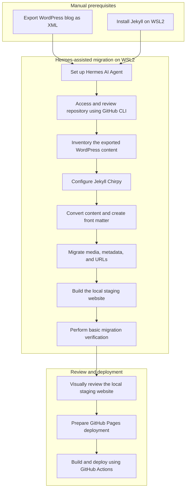

I migrated my database-backed WordPress blog to a Markdown-based Jekyll site hosted on GitHub Pages, with most of the work performed by Hermes AI Agent on WSL2.

This article is a concise account of how Hermes helped me complete the migration, even though I was not familiar with Jekyll or Chirpy when I started.

Hermes AI Agent was set up on WSL2 and used GitHub CLI to work with and review the migration repository. My only manual steps were exporting the WordPress blog as an XML file and installing Jekyll on WSL2. Hermes handled the migration workflow and basic verification. I reviewed only the locally staged website, checking visually that the core pages and posts rendered correctly.

* * *

## 1. Why I Decided to Move Away From WordPress

I left WordPress because the long-term operational burden started to feel heavier than the value it gave me.

### The main trade-offs for me

1. Hosting and maintenance overhead.
2. Plugin and theme update risk (and the occasional “works locally, breaks in production” surprises).
3. Security responsibilities.
4. Performance optimization work that kept pulling focus away from writing.
5. Database and backup management.
6. Preference for writing in Markdown and keeping the entire blog in Git.
7. Lower hosting complexity and cost when moving to GitHub Pages.

### What WordPress did well

To keep this balanced, I want to acknowledge what WordPress handled better than I expected:

1. A frictionless editor for non-technical workflows.
2. A straightforward “publish now” experience.
3. A huge ecosystem of plugins for common needs.

In the end, though, I wanted a writing workflow that fit better with version control and code-review style collaboration.

## 2. Why I Chose Jekyll, Chirpy, and GitHub Pages

I picked the combination of Jekyll + Chirpy + GitHub Pages because it matched the requirements I cared about most.

### Why this stack fit my needs

1. Markdown-based content.
2. Version-controlled posts and configuration in Git.
3. Pull-request-based editing (review before merge).
4. Built-in GitHub Pages deployment integration.
5. Automated deployment through GitHub Actions.
6. Chirpy features that align with technical blogging:
   - categories and tags archives
   - search
   - table of contents
   - code-focused layout
   - clean reading experience
7. Reduced server-side maintenance compared to a database-backed CMS.

### Alternatives I considered

I considered other static-site frameworks and CMS options, but I stayed with Jekyll because:

1. The learning curve was manageable.
2. The ecosystem and deployment model were already familiar to me.
3. Chirpy provided the “right kind” of blog structure for developer-focused content.


### Chirpy setup on WSL2

After Jekyll was available, Hermes used the Chirpy starter repository as the migration target. The equivalent setup commands are:

```bash
gh repo create vaibhav-gawali.github.io --public --clone --template cotes2020/chirpy-starter
cd vaibhav-gawali.github.io
bundle install
```

If the repository already exists, clone it instead:

```bash
gh repo clone vaibhav-gawali/vaibhav-gawali.github.io
cd vaibhav-gawali.github.io
bundle install
```

Hermes then copied and transformed the exported WordPress content, configured Chirpy, and used GitHub CLI to review the repository state.

## 3. Planning the Migration Before Touching the Website

Before converting content, Hermes reviewed the exported content and migration requirements so that important reader entry points would not be lost.

### What Hermes considered

1. Existing posts and pages.
2. Categories and tags.
3. Featured images and inline media.
4. Internal links.
5. Comments.
6. Author information.
7. Permalinks.
8. SEO titles and descriptions.
9. Draft posts and status.
10. Downloadable attachments.
11. Analytics and verification codes.

### Key takeaway

Migrating HTML is only one part of moving a blog.

The harder parts are URLs, metadata, images, and the paths readers (and search engines) already use.

### Migration workflow



## 4. Exporting Content From WordPress

WordPress exports produced a migration input file (not a ready-to-publish Jekyll site).

### What I exported

1. Posts.
2. Pages.
3. Categories.
4. Tags.
5. Publication dates.
6. Authors.
7. Comments (if applicable).
8. Media references.
9. Draft and published status.

### Practical note

In most WordPress setups, the export format is WXR/XML.

I treated that file as the source of truth and used it as the input to conversion and mapping steps.

## 5. Converting WordPress Posts to Jekyll Markdown

This was the most useful technical section of the migration.

### How I converted content

Hermes handled a workflow like this:

1. Convert the WordPress HTML body into Markdown.
2. Review and clean the generated Markdown (tables, lists, and code blocks often need attention).
3. Create a new Jekyll post file using the date–title convention.
4. Add YAML front matter.
5. Map categories and tags.
6. Preserve publication dates.
7. Handle excerpts (so the theme can show consistent summaries).
8. Remove WordPress-specific shortcodes.
9. Fix malformed or broken links.

### File naming and front matter structure

Hermes generated posts using the Jekyll date-title convention:

- `_posts/YYYY-MM-DD-slug.md`

I created YAML front matter for each post, including at minimum:

- `title`
- `date`
- `categories` and `tags` mapping
- `description` (so social previews behave consistently)

### Before-and-after example

WordPress HTML example:

Before:

- ` <a href="https://example.com">Read more</a> `

Jekyll Markdown example:

After:

- `[Read more](https://example.com)`

Code block conversion example:

Before:

- WordPress wrapped code blocks in HTML tags and sometimes included extra markup.

After:

- I converted to fenced code blocks using triple backticks and ensured the rendered output remained readable.

### What I watched for during conversion

1. Code fences that broke Markdown parsing.
2. Inline images that referenced the old host or missing paths.
3. Special characters that caused invalid links.
4. Tables that rendered incorrectly.

## 6. Moving Images and Other Media

Hermes handled the media migration, focusing on path correctness and completeness.

### What Hermes handled

1. WordPress media-library URLs.
2. Featured images.
3. Inline screenshots.
4. Relative versus absolute paths.
5. Missing media files.
6. Image names containing spaces or special characters.
7. Duplicate files.
8. Large image sizes.
9. Alt text.
10. External storage (if I had used it previously).

### Repeatable “broken image references” process

Hermes used a checklist approach, followed by my visual review of the local staging site:

1. Search the generated Markdown/HTML for `/wp-content/` or the old domain.
2. Compare referenced filenames against what exists under `assets/images/`.
3. Preview the site and visually verify images on:
   - post pages
   - tag/category pages
   - lists that show excerpts
4. Fix missing assets first, then normalize paths.

## 7. Mapping WordPress Metadata to Chirpy Front Matter

To make the site feel consistent after migration, Hermes mapped the old metadata into Chirpy-compatible front matter.

### Mapping decisions

1. Whether to retain all old categories.
2. Normalizing inconsistent tags.
3. Whether author names needed to remain.
4. Handling last-modified dates.
5. Adding descriptions to older posts that previously had none.

### Example front matter

```yaml
---
title: "Example Post Title"
date: 2026-08-20 10:30:00 +0530
categories: [DotNet, Architecture]
tags: [aspnet-core, clean-architecture]
description: "A short description of the article."
---
```

## 8. Preserving WordPress URLs and SEO Value

This section deserves extra attention because broken links are the biggest migration risk.

### What Hermes prepared and checked locally

1. Recorded the original WordPress permalink structure.
2. Matched old slugs where possible.
3. Identified URLs that would change.
4. Prepared redirects for changed URLs.
5. Updated internal links to the new site structure.
6. Preserved canonical intent.
7. Carried over page titles and descriptions.
8. Recreated sitemap and robots configuration as needed.
9. Checked important pages in the local staging site.

I did not perform a separate production SEO or search-index verification as part of this review.

### Compact URL-mapping worksheet

```text
Old WordPress URL | New Jekyll URL | Redirect required | Migration status | Notes
```

(Replace the placeholders above with a real worksheet in your migration repo.)

## 9. Configuring the Chirpy Theme

After the content was in place, Hermes configured the Chirpy theme to match the migration goals.

### Focus areas

1. Site title and description.
2. Author profile and avatar.
3. Social links.
4. Locale and timezone.
5. Categories and tags behavior.
6. Search and table of contents.
7. Syntax highlighting for code blocks.
8. Dark/light appearance.
9. Favicons and footer details.

Hermes explicitly configured the settings that mattered for readability and SEO instead of leaving them at defaults.

## 10. Running and Testing the Blog Locally

The local staging site was the only environment I reviewed manually.


### Installing Jekyll on WSL2

Installing Jekyll was one of my two manual steps. On Ubuntu under WSL2, I used the following Linux-based setup:

```bash
sudo apt update
sudo apt install -y ruby-full build-essential zlib1g-dev

echo "# Ruby Gems" >> ~/.bashrc
echo 'export GEM_HOME="$HOME/gems"' >> ~/.bashrc
echo 'export PATH="$HOME/gems/bin:$PATH"' >> ~/.bashrc
source ~/.bashrc

gem install jekyll bundler
jekyll -v
bundler -v
```

From the Chirpy repository, I installed the project dependencies and started the local staging site:

```bash
cd vaibhav-gawali.github.io
bundle install
bundle exec jekyll serve
```

I then reviewed the site locally at `http://127.0.0.1:4000/`.

### What I validated

1. Post rendering.
2. Category and tag pages.
3. Code blocks and fenced code formatting.
4. Internal links.
5. Image references.
6. Mobile layouts.
7. Generated site correctness from a clean checkout.

Hermes performed basic verification during this phase, while I visually reviewed the local staging output. I did not carry out an independent code-level or production-site verification.

## 11. Deploying to GitHub Pages With GitHub Actions

Hermes prepared the GitHub Pages deployment and automated build workflow. From WSL2, it used GitHub CLI to inspect the repository and review the migration state.

### What the deployment model looks like

1. Repo layout that matches Jekyll expectations.
2. Branch strategy aligned with GitHub Pages deploy.
3. Build workflow:
   - install Ruby dependencies
   - run `jekyll build`
   - upload artifact
4. Deploy step to GitHub Pages.
5. Deployment status checks and troubleshooting logs.

### Chirpy integration style

I used Chirpy’s typical approach (remote theme) with a local build first to ensure the output was correct.

## 12. Moving the Custom Domain

If your WordPress blog used a custom domain, I strongly recommend separating the domain transition from the content migration.

### Domain migration steps

1. Detach the domain from the previous host.
2. Validate the GitHub Pages site first.
3. Add the `CNAME` file.
4. Update DNS records.
5. Wait for propagation.
6. Enable HTTPS.
7. Test both `www` and apex domain behavior.
8. Avoid redirect loops.
9. Keep a rollback plan.

If the domain move was postponed, that itself became a valuable lesson:

Complete and validate platform migration first, then introduce DNS as another variable.

## 13. Migration Risks Hermes Checked

Because Hermes performed the migration and basic verification, the following were migration risks it checked or addressed. I did not independently reproduce every issue.

### Check 1

- Symptom: WordPress shortcodes appeared as plain text.
- Root cause: Conversion left shortcode tokens intact.
- Fix: Removed WordPress-specific shortcodes during conversion.
- How to prevent it: Build a list of shortcodes used on your site and explicitly handle them.

### Check 2

- Symptom: Posts contained a mixture of Markdown and HTML.
- Root cause: WordPress editor content sometimes outputs HTML fragments.
- Fix: Clean up the Markdown conversion output and standardize.
- How to prevent it: Run a conversion pass, then do a review pass before committing.

### Check 3

- Symptom: Incorrect dates or timezone values.
- Root cause: WordPress stored dates in its local timezone settings.
- Fix: Normalize to the Jekyll convention used by the theme.
- How to prevent it: Test one post end-to-end and verify timestamps on the rendered site.

### Check 4

- Symptom: Broken image references.
- Root cause: Image paths referenced the old host or were missing in the assets folder.
- Fix: Copy media files and update image paths.
- How to prevent it: Run the “broken image references” process after conversion.

### Check 5

- Symptom: GitHub Actions build worked locally but failed in CI.
- Root cause: Dependency mismatch or environment difference.
- Fix: Make the build reproducible by aligning bundler and lock behavior.
- How to prevent it: Test builds with the same command that CI uses.

## 14. WordPress Versus Jekyll After the Migration

I’ll keep this balanced.

- Writing workflow: Jekyll fits a reviewable, Markdown-first process.
- Hosting: GitHub Pages is simpler than server management.
- Maintenance: Jekyll reduced ongoing “keep the platform healthy” work.
- Security: Less surface area without a database-backed CMS.
- Performance: The static site model made performance predictable.
- Extensibility: WordPress plugins are unmatched, but Jekyll is enough for a technical blog.
- Publishing convenience: WordPress made instant publishing easier.
- Version history: Git wins for posts and configuration.
- Collaboration: PR-based collaboration felt natural.
- Nontechnical editor experience: WordPress is better for WYSIWYG editing.

My conclusion is not that Jekyll is universally better.

Instead, WordPress and Jekyll optimize for different publishing workflows.

Jekyll became the better fit for how I wanted to write, review, version, and deploy technical content.

## 15. My Final Migration Checklist

- Content exported (posts, pages, media references, metadata).
- Posts converted and reviewed.
- Front matter reviewed (title, date, categories, tags, description).
- Media copied and verified.
- Internal links updated.
- Old and new URLs mapped.
- Redirects configured.
- Categories and tags cleaned.
- Local build tested.
- GitHub Actions workflow prepared and reviewed by Hermes using GitHub CLI.
- Domain update treated as a separate follow-up step (currently not done).
- HTTPS enabled (if applicable).
- Analytics restored.
- Sitemap submission planned or verified separately after production launch.
- Backup retained.
