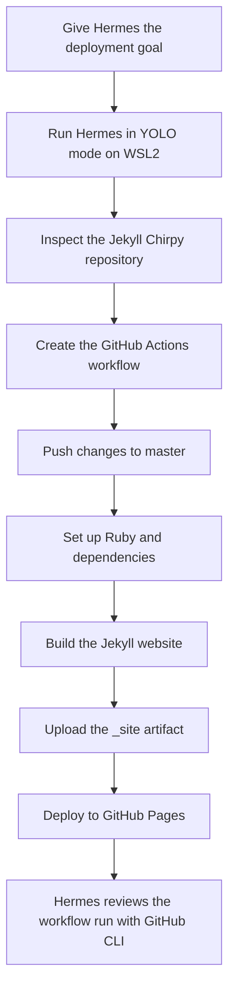

## Introduction

After migrating my WordPress blog to Jekyll Chirpy, I needed an automated way to build and deploy it to GitHub Pages. I was still learning Jekyll, Chirpy, and GitHub Actions, so I gave Hermes AI Agent the goal and ran it in **YOLO mode** on WSL2.

Hermes inspected the repository, created the workflow, used GitHub CLI to review its execution, and performed basic verification. I reviewed the local staging website rather than writing each workflow step myself.

> In this article, **YOLO mode** means Hermes could run commands and modify repository files without asking for approval at every step. GitHub permissions and repository controls still applied.

## 1. The Deployment Problem

I wanted the repository to:

1. Start a workflow when code reached the `master` branch.
2. Install Ruby, operating-system packages, and gem dependencies.
3. Build the Jekyll website into `_site`.
4. Upload the generated website as a Pages artifact.
5. Deploy that artifact to GitHub Pages.
6. Show enough logs for Hermes to review failures.

HTML validation, dependency caching, concurrency control, and deployment-environment improvements are useful next steps, but they are not part of my current workflow.

## 2. Why I Used Hermes in YOLO Mode

I used YOLO mode because this was a multi-step task and I did not want Hermes to pause before every command. Hermes handled the implementation in this order:

1. Inspected the repository from WSL2.
2. Reviewed the Jekyll and Chirpy setup.
3. Used GitHub CLI to inspect repository and workflow details.
4. Created `.github/workflows/pages-build-deploy.yml`.
5. Ran basic build and workflow checks.
6. Reviewed workflow runs and logs.

My role was simple: I defined the outcome and visually reviewed the locally staged website.

## 3. Scope and Safety Boundaries

YOLO mode made the work faster, but it also allowed the agent to change an important CI/CD file. I therefore treated the repository as the safety boundary:

1. Git recorded every change.
2. The workflow received only the permissions needed for Pages deployment.
3. No unrelated credentials were intentionally provided.
4. The generated workflow remained reviewable and reversible.
5. GitHub remained responsible for enforcing repository and workflow permissions.

For future agent-driven changes, I plan to use a dedicated branch, review the diff, and keep branch protection enabled.

## 4. End-to-End Workflow



## 5. Why I Used GitHub Actions

GitHub Pages hosts the generated website, while GitHub Actions performs the build and deployment. This gave Hermes control over:

1. The Ruby version.
2. Required Linux packages.
3. Bundler installation behavior.
4. The Jekyll build command.
5. Artifact upload and Pages deployment.
6. Build and deployment logs.

## 6. The Workflow Hermes Created

Hermes created the following file:

```text
.github/workflows/pages-build-deploy.yml
```

This is the actual workflow from my repository:

```yaml
name: Deploy GitHub Pages (Jekyll)

on:
  push:
    branches: [ master ]
  workflow_dispatch:

permissions:
  contents: read
  pages: write
  id-token: write

jobs:
  build:
    runs-on: ubuntu-latest
    steps:
      - name: Checkout
        uses: actions/checkout@v4

      - name: Setup Ruby
        uses: ruby/setup-ruby@v1
        with:
          ruby-version: '3.3'
          bundler-cache: false

      - name: Install OS dependencies
        run: |
          sudo apt-get update
          sudo apt-get install -y libssl-dev

      - name: Bundle install (no frozen lock)
        run: |
          bundle config set frozen false
          bundle install --jobs 4 --retry 3

      - name: Build with Jekyll
        run: |
          bundle exec jekyll build --config _config.yml --destination _site

      - name: Upload artifact
        uses: actions/upload-pages-artifact@v3
        with:
          path: _site

  deploy:
    needs: build
    runs-on: ubuntu-latest
    steps:
      - name: Deploy to GitHub Pages
        id: deployment
        uses: actions/deploy-pages@v4
```

The remaining sections tell the story of what Hermes put into this workflow and what I may improve later.

## 7. Hermes Defined When Deployment Starts

Hermes configured two ways to start the workflow:

```yaml
on:
  push:
    branches: [ master ]
  workflow_dispatch:
```

This means:

1. A push to `master` starts the workflow automatically.
2. `workflow_dispatch` lets me start it manually from the Actions tab.
3. Other branches do not deploy the website.

As a future improvement, I may add `paths-ignore` so documentation-only repository changes do not start a deployment.

## 8. Hermes Applied Pages Permissions

Next, Hermes added the permissions required by the official Pages deployment action:

```yaml
permissions:
  contents: read
  pages: write
  id-token: write
```

Each permission has a narrow purpose:

1. `contents: read` allows the workflow to check out the repository.
2. `pages: write` allows it to deploy to GitHub Pages.
3. `id-token: write` supports the Pages identity flow.

This mattered because YOLO mode gave Hermes autonomy inside the workspace, but the resulting workflow still followed GitHub's permission boundary.

## 9. Hermes Separated Build From Deployment

Hermes created two jobs:

1. `build` prepares the static website and uploads it.
2. `deploy` publishes the uploaded artifact.

The line below connects them:

```yaml
needs: build
```

If the build fails, the deployment job does not start. This was the main safety gate in my current workflow.

The workflow does not yet define `concurrency`. I may later add the following to favor the newest deployment when commits arrive close together:

```yaml
concurrency:
  group: pages
  cancel-in-progress: true
```

## 10. Hermes Checked Out the Repository

The build started by making the repository available to the runner:

```yaml
- name: Checkout
  uses: actions/checkout@v4
```

I kept this exactly as Hermes generated it. It uses the action's default checkout depth. If Chirpy features later require complete Git history, I can test `fetch-depth: 0` as a future change.

## 11. Hermes Selected the Ruby Environment

Hermes configured Ruby 3.3:

```yaml
- name: Setup Ruby
  uses: ruby/setup-ruby@v1
  with:
    ruby-version: '3.3'
    bundler-cache: false
```

This step gave the runner the Ruby environment needed by Jekyll and Chirpy. Caching is currently disabled, so each run installs the required gems again.

A future improvement is to enable `bundler-cache: true` after confirming that `Gemfile.lock` is stable and compatible with the build.

## 12. Hermes Installed the Required Linux Package

The hosted runner also needed an operating-system dependency:

```yaml
- name: Install OS dependencies
  run: |
    sudo apt-get update
    sudo apt-get install -y libssl-dev
```

Hermes added `libssl-dev` before Bundler ran. This kept the dependency setup explicit in the workflow rather than relying on my local WSL2 environment.

## 13. Hermes Chose a Flexible Bundle Install

Hermes then installed the Ruby dependencies:

```yaml
- name: Bundle install (no frozen lock)
  run: |
    bundle config set frozen false
    bundle install --jobs 4 --retry 3
```

The current behavior is intentional:

1. `frozen false` allows dependency resolution even if the lock file needs adjustment.
2. `--jobs 4` installs dependencies in parallel.
3. `--retry 3` retries temporary failures.

For stronger reproducibility, I may later commit and enforce a stable `Gemfile.lock`, enable frozen mode, and turn on Bundler caching.

## 14. Hermes Built the Jekyll Website

Once the dependencies were ready, Hermes used the repository's Jekyll configuration to generate the site:

```yaml
- name: Build with Jekyll
  run: |
    bundle exec jekyll build --config _config.yml --destination _site
```

This does three things:

1. `bundle exec` uses the gems installed for this project.
2. `--config _config.yml` loads the blog configuration.
3. `--destination _site` writes the deployable static website to `_site`.

The current workflow does not explicitly set `JEKYLL_ENV=production`. I may test that later rather than claiming it is already part of the implementation.

## 15. Hermes Uploaded the Generated Website

After a successful build, Hermes packaged the output for GitHub Pages:

```yaml
- name: Upload artifact
  uses: actions/upload-pages-artifact@v3
  with:
    path: _site
```

Only `_site` is handed to the deployment job. The deployment job therefore publishes the same generated output produced by the build job instead of rebuilding it.

## 16. Hermes Connected the Deployment Job

Hermes completed the pipeline with the official Pages deployment action:

```yaml
deploy:
  needs: build
  runs-on: ubuntu-latest
  steps:
    - name: Deploy to GitHub Pages
      id: deployment
      uses: actions/deploy-pages@v4
```

The sequence is short:

1. Wait for `build` to succeed.
2. Start a fresh Ubuntu runner.
3. Publish the uploaded Pages artifact.

The current workflow does not explicitly declare a `github-pages` environment or expose the deployment URL in the job definition. Those are possible future improvements.

## 17. Hermes Reviewed the Workflow Through GitHub CLI

Creating the YAML file was not the end of the task. Hermes also used GitHub CLI from WSL2 to inspect the repository and review workflow activity.

Depending on the stage, this type of review can include:

```bash
gh repo view
gh workflow list
gh run list
gh run view <run-id> --log-failed
```

I will include only the exact commands I can confirm from the Hermes session or terminal history before publishing the post. The important point is that Hermes could move from editing the workflow to inspecting its GitHub execution without relying only on the browser.

## 18. What I Reviewed Personally

Hermes performed most of the technical work. My review was deliberately smaller:

1. I checked the locally staged Jekyll website.
2. I confirmed that the main pages and posts rendered as expected.
3. I reviewed the visible result rather than authoring every workflow line.
4. I relied on Hermes for basic repository and workflow checks.

I am not treating that local review as proof of production SEO, redirect behavior, sitemap submission, or search indexing. Those remain separate follow-up activities.

## 19. What the Current Workflow Does Not Yet Validate

A successful Jekyll build proves that the site can be generated, but it does not detect every content problem. My current workflow does not run HTMLProofer or another generated-site validator.

I may add a step like this later:

```yaml
- name: Test site
  run: bundle exec htmlproofer _site
```

That future check could detect:

1. Broken internal links.
2. Missing local images.
3. Invalid generated references.
4. Broken category or tag pages.
5. Old WordPress paths left in migrated content.

I would keep unreliable external-link checks separate so a temporary third-party outage does not block every deployment.

## 20. Problems I Would Diagnose Next

Hermes gave me a working baseline and useful logs. If a future run fails, I would investigate in this order:

1. **Dependency failure:** compare Ruby, `Gemfile`, and `Gemfile.lock`, then run `bundle install` locally.
2. **Local success but Actions failure:** check ignored files, filename case, Ruby versions, and environment-specific paths.
3. **Build succeeds but styling is missing:** inspect `url`, `baseurl`, asset paths, Pages settings, and custom-domain configuration.
4. **Deployment does not start:** confirm that `build` passed, Pages uses GitHub Actions, and the required permissions remain present.
5. **Content validation failure after future hardening:** run the same validator locally and correct the source Markdown or asset path.

A useful local diagnostic command for a future production-mode test is:

```bash
JEKYLL_ENV=production bundle exec jekyll build --trace
```

## 21. What YOLO Mode Taught Me

Using Hermes in YOLO mode worked well for this personal blog because it removed repeated approval pauses and let the agent complete a connected sequence of repository, shell, YAML, and GitHub CLI tasks.

My main lessons were:

1. **Autonomy accelerated the work.** Hermes moved from repository inspection to a deployable workflow without requiring me to learn every tool first.
2. **The generated result still needed ownership.** I needed to understand what the workflow changed and what it did not include.
3. **Git remained essential.** Every agent change was reviewable and reversible.
4. **Permissions mattered more in YOLO mode.** Agent autonomy should not lead to broad GitHub access.
5. **Basic verification had limits.** A working build did not replace production, content, SEO, or security checks.

My takeaway is simple: YOLO mode was effective because the task ran inside a controlled repository with visible changes and limited deployment permissions.

## 22. Current Status and Future Improvements

### Implemented now

1. Deployment is restricted to `master`.
2. Manual workflow execution is available.
3. Pages permissions are explicitly scoped.
4. Build and deployment are separate jobs.
5. Ruby 3.3 and `libssl-dev` are installed.
6. Bundler installs the project dependencies.
7. Jekyll builds the site into `_site`.
8. The Pages artifact is uploaded and deployed.
9. Hermes can review runs through GitHub CLI.

### Future activities

1. Add concurrency control.
2. Enable Bundler caching.
3. Stabilize and enforce `Gemfile.lock`.
4. Build explicitly with `JEKYLL_ENV=production`.
5. Add HTMLProofer or equivalent validation.
6. Consider a `github-pages` environment and deployment URL.
7. Validate pull requests before merge.
8. Review action version-pinning strategy.
9. Perform a separate production and SEO review.

## 23. Conclusion

I started with a deployment goal, not deep knowledge of Jekyll, Chirpy, or GitHub Actions. Hermes AI Agent, running in YOLO mode on WSL2, turned that goal into the workflow now stored in my repository.

The current workflow is intentionally small: it installs dependencies, builds the blog, uploads `_site`, and deploys it to GitHub Pages. Hermes also used GitHub CLI to review the result, while I focused on the local staging website.

The next step is not to rewrite the working baseline. It is to improve it gradually with caching, concurrency, production-mode builds, pull-request checks, and generated-site validation.
