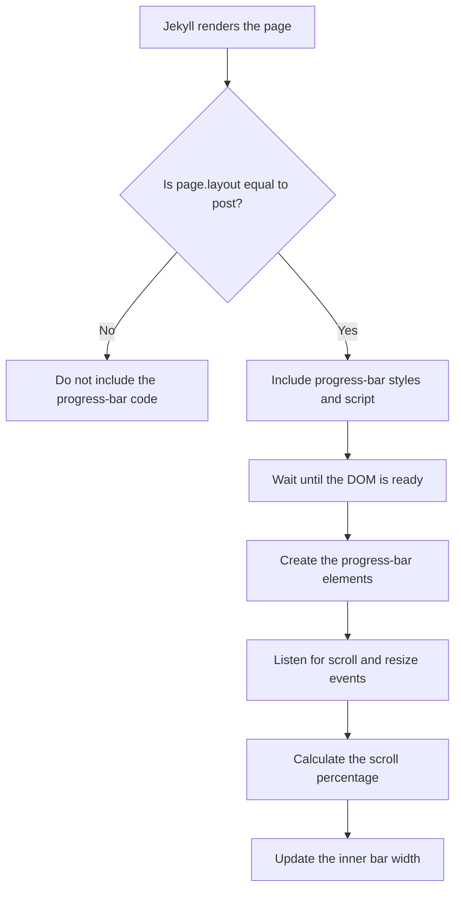
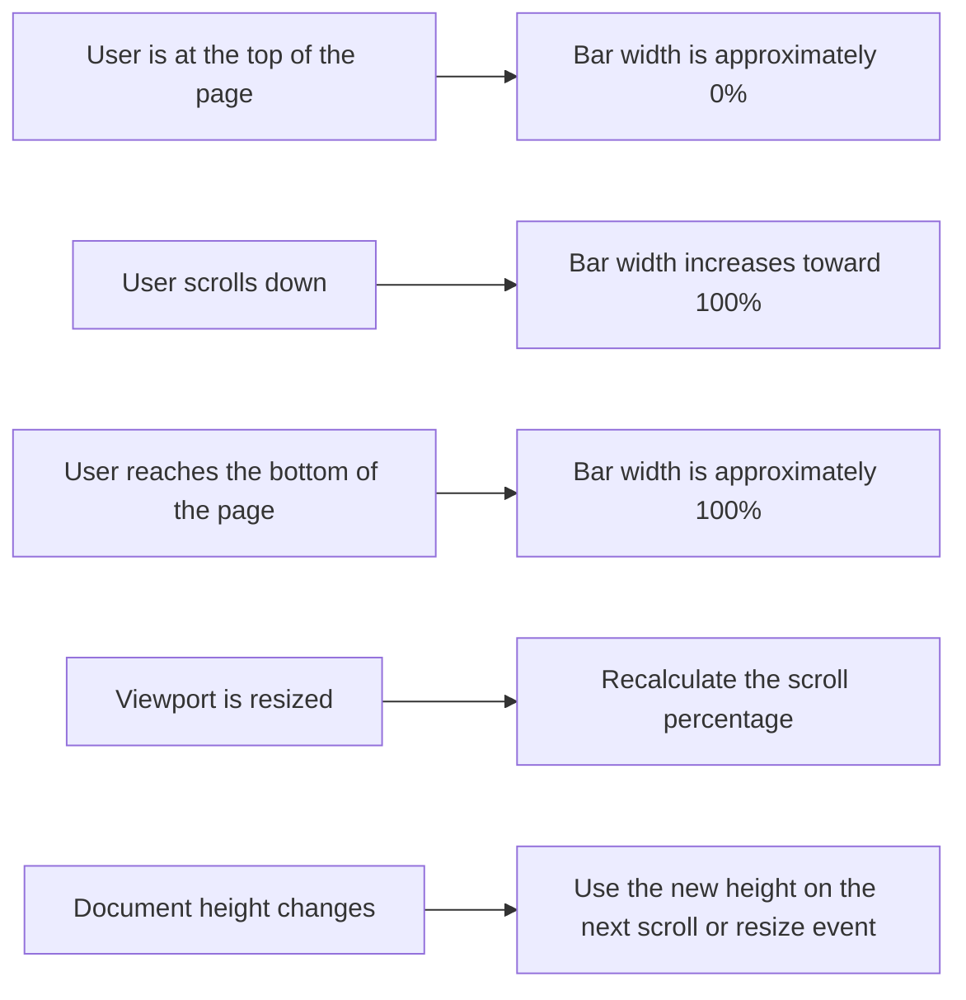

A thin progress bar at the top of a blog post looks like a small feature. It quietly grows as the reader moves through the article and reaches the end at roughly the same time as the reader.

Building one should be straightforward: create an element, calculate the scroll percentage, and update its width.

That was the plan, at least.

What followed became a useful lesson in AI-assisted software development. One AI agent wrote the initial implementation, another analyzed evidence from Browser Tools and prepared a precise handoff, and a third used that handoff to finish the job.

This is the story of how I added a theme-aware reading progress bar to my Jekyll Chirpy blog, where the first attempt went wrong, and why direct browser observations were more valuable than another round of guessing.

## 1. Defining the requirement

I captured the original requirement in [Issue #16: Add a theme-aware reading progress bar to blog post pages](https://github.com/vaibhav-gawali/vaibhav-gawali.github.io/issues/16).

The goal was to display a reading progress indicator fixed to the top of the viewport while someone reads a blog post.

The main requirements were:

- Show a thin progress bar only on blog post pages.
- Keep the indicator fixed at the top of the viewport.
- Increase its width as the reader scrolls through the page.
- Recalculate progress when the viewport size changes.
- Integrate with the site's light and dark themes.
- Respect `prefers-reduced-motion`.
- Avoid coupling the implementation to fragile theme-specific selectors.
- Leave Home, About, category, and other non-post pages unchanged.

The implementation and review activity took place in [Pull Request #17: feat: add reading progress bar to post pages](https://github.com/vaibhav-gawali/vaibhav-gawali.github.io/pull/17).

The feature was added through:

```text
_includes/metadata-hook.html
```

Chirpy exposes this hook, so the feature could be added without editing the theme's core files.

## 2. Starting with Hermes AI in YOLO mode

I used Hermes AI in YOLO mode for the initial implementation.

The attraction of this workflow is speed. Instead of reviewing every individual edit before it happens, the agent can inspect the repository, make changes, and move the task forward with minimal interruption.

Hermes attempted to:

1. Run the feature only when `page.layout == 'post'`.
2. Locate the post content.
3. Create the progress-bar elements.
4. Insert those elements into the page.
5. Attach scroll and resize event handlers.
6. Calculate the percentage read.
7. Apply that percentage to the inner bar's width.

Conceptually, the flow looked reasonable:



However, when I opened a post page, there was no progress bar.

## 3. When the implementation looked right but did nothing

The next challenge was separating what I expected the code to do from what the browser was actually doing.

I inspected the generated page with Browser Tools. The progress-bar CSS was present in a `<style>` element:

```css
#reading-progress {
  position: fixed;
  top: 0;
  left: 0;
  width: 100%;
  height: 12px;
  z-index: 2147483647;
  pointer-events: none;
  background: #ff3b30 !important;
}

#reading-progress-bar {
  width: 100%;
  height: 100%;
  display: block;
  background: #ff3b30 !important;
  opacity: 1 !important;
  will-change: width;
}
```

This gave me an important clue.

The Liquid condition was being evaluated successfully. Jekyll knew that I was viewing a post page, and the browser was receiving the related CSS.
I inspected the generated post using Browser Tools. The progress-bar CSS was present in a `<style>` element. This was an important clue because it established that:

- Jekyll had processed the relevant metadata hook.
- The `page.layout == 'post'` condition had evaluated successfully.
- The browser had received at least the styling portion of the feature.

However, CSS can only style elements that exist. It cannot create the required progress-bar DOM nodes.

To inspect the live page, I ran this diagnostic query in the browser console:

```js
({
  article:
    document.querySelector('article[data-toc]') ||
    document.querySelector('article'),
  directContent: document.querySelector('article > .content'),
  nestedContent: document.querySelector('article .content'),
  postContent: document.querySelector('#post-content'),
  progress: document.getElementById('reading-progress')
})
```

The most significant result was:

```js
progress: null
```

That single observation changed the direction of the investigation.

The problem was not simply that the bar was transparent, hidden behind the header, or stuck at zero width. The progress-bar container did not exist in the live DOM at all.

## 4. Bringing the evidence to GPT-5.6 Thinking

At this point, I brought the implementation and my Browser Tools observations to GPT-5.6 Thinking.

Instead of treating the missing bar as a styling problem, it reasoned backward from the runtime evidence:

- The CSS was present, so the Jekyll post condition had executed.
- `progress: null` meant JavaScript had not inserted the expected element.
- The script therefore did not run, failed before insertion, or exited early.

The most likely failure was a dependency on selectors similar to these:

```js
const article =
  document.querySelector('article[data-toc]') ||
  document.querySelector('article');

if (!article) return;

const content =
  article.querySelector(':scope > .content') ||
  article.querySelector('.content');

if (!content) return;
```

This implementation assumes that the installed Chirpy version renders a `.content` element inside the selected article.

If the generated markup does not match that assumption, `content` becomes `null`. The script then silently returns before it reaches the code that creates and inserts the progress bar.

No visible JavaScript exception is required for this failure. The early return is valid JavaScript, so initialization simply stops.

## 5. Discovering a second issue

The browser evidence revealed the missing DOM node, but the CSS contained another issue that would have become visible after fixing the JavaScript.

The outer progress container had a solid red background:

```css
#reading-progress {
  width: 100%;
  background: #ff3b30 !important;
}
```

If the full-width outer container receives the same visible background as the inner progress bar, the display can look permanently complete. The intended visual model is:
The correct visual model is:

- The outer container controls the fixed position and track dimensions.
- The outer container remains transparent.
- The inner bar receives the theme-aware visible color.
- JavaScript changes only the inner bar's width.

For example, the structural behavior should be equivalent to:

```css
#reading-progress {
  background: transparent;
}

#reading-progress-bar {
  width: 0;
  background: #ff3b30;
}
```

The final color should come from the site's theme-aware styling rather than relying on a forced debugging color.

This was a useful reminder that one feature can contain multiple defects. The first prevented the elements from appearing. Once repaired, the second could have made the result appear stuck at 100 percent.

## 6. Converting the diagnosis into a [handoff (executable plan)](https://github.com/vaibhav-gawali/vaibhav-gawali.github.io/pull/17#issuecomment-5548923327)

Finding the likely root cause was only part of the task. Hermes needed a clear plan that could be executed reliably by its GPT-5.4 Nano model.

GPT-5.6 Thinking converted the diagnosis into a structured implementation handoff. That handoff is preserved in the [PR #17 handoff comment](https://github.com/vaibhav-gawali/vaibhav-gawali.github.io/pull/17#issuecomment-5548923327).

The [handoff documented](https://github.com/vaibhav-gawali/vaibhav-gawali.github.io/pull/17#issuecomment-5548923327):

- The confirmed browser evidence.
- The primary JavaScript failure mode.
- The secondary visual defect.
- A replacement implementation.
- An ordered debugging path.
- Build and browser-verification steps.
- Explicit acceptance criteria.

This level of detail mattered because an execution-focused model benefits from reduced ambiguity.

Instead of saying, "Fix the progress bar," the handoff explained:

1. What had already been observed.
2. What those observations proved.
3. Which assumptions needed to be removed.
4. Which code path needed to change.
5. How to validate the generated HTML and live DOM.
6. What had to be true before the work could be considered complete.

The collaboration looked like this:


## 7. Implementing a more resilient solution

The revised approach removed the dependency on Chirpy's internal content wrappers.

Instead of requiring `.content` or `article .content`, it calculates progress from the document's scrolling element:

```js
const scrollingElement =
  document.scrollingElement || document.documentElement;

const scrollTop =
  scrollingElement.scrollTop || window.scrollY || 0;

const scrollableHeight =
  scrollingElement.scrollHeight - scrollingElement.clientHeight;

const percentage =
  scrollableHeight > 0
    ? (scrollTop / scrollableHeight) * 100
    : 0;
```

The calculated value is clamped before being applied:

```js
progressBar.style.width =
  Math.min(100, Math.max(0, percentage)) + '%';
```

The initialization also protects against duplicate elements:

```js
if (document.getElementById('reading-progress')) {
  return;
}
```

The required DOM structure is then created directly:

```js
const progress = document.createElement('div');
progress.id = 'reading-progress';
progress.setAttribute('aria-hidden', 'true');

const progressBar = document.createElement('div');
progressBar.id = 'reading-progress-bar';

progress.appendChild(progressBar);
document.body.prepend(progress);
```

This version is less sensitive to changes in the theme's internal markup. It relies on the document body and the browser's scrolling element, which are more stable integration points.

## 8. Progress bar behavior in common situations

The final behavior is simple from the reader's perspective:



The final case is deliberately precise. If dynamic content changes the document height, the implementation uses that new height the next time a scroll or resize event triggers recalculation. Detecting every dynamic change immediately would require an additional mechanism such as `ResizeObserver` or `MutationObserver`.

## 9. Verifying the final result

After receiving the structured handoff, Hermes AI was able to correct the implementation and complete [PR #17](https://github.com/vaibhav-gawali/vaibhav-gawali.github.io/pull/17).

The completed behavior was verified across Edge, Chrome, and Commet.

### 9.1 Post-page verification

- The progress bar renders automatically.
- The width updates while the reader scrolls.
- Progress stays between 0 and 100 percent.
- The appearance works with light and dark modes.
- Resizing the viewport recalculates progress.
- The implementation does not depend on fragile `.content` selectors.
- No JavaScript console errors were observed during verification.

### 9.2 Non-post-page verification

The progress bar does not appear on:

- Home
- About

This confirms that the feature remains limited to pages using the post layout, as requested in [Issue #16](https://github.com/vaibhav-gawali/vaibhav-gawali.github.io/issues/16).

## 10. What I learned

### 10.1 Browser evidence is more valuable than confident guessing

The most useful clue was this runtime result:

```js
progress: null
```

It narrowed the problem from "the bar is not visible" to "the bar does not exist."

That distinction ruled out several distracting possibilities and focused the investigation on script execution, DOM insertion, and early returns.

### 10.2 Silent failure paths deserve special attention

Code such as this can make debugging deceptively difficult:

```js
if (!content) return;
```

It avoids a console exception, but it also hides why initialization stopped.

During development, a temporary diagnostic message can expose the stopping point:

```js
if (!content) {
  console.debug('[reading-progress] Content element was not found');
  return;
}
```

The debug output can be removed after the issue is resolved.

### 10.3 Theme internals are fragile integration points

A selector such as `.content` may work with one theme version or customization and fail with another.

When a feature represents whole-page reading progress, calculating against the document is simpler and more resilient than locating a theme-specific content wrapper.

### 10.4 AI agents work better with explicit acceptance criteria

A high-level instruction leaves room for assumptions. A precise handoff provides a measurable target.

For this task, the important acceptance criteria included:

1. `#reading-progress` exists in the live DOM on post pages.
2. `#reading-progress-bar` exists inside the container.
3. The width changes while scrolling.
4. The width stays between 0 and 100 percent.
5. The outer container does not make the track appear permanently full.
6. The visible bar follows the intended theme-aware styling.
7. Non-post pages do not include the feature.
8. The browser console remains free of related errors.

These checks gave Hermes a concrete definition of "fixed."

### 10.5 Different AI models can play different engineering roles

This activity did not follow a one-shot pattern where a single model generated perfect code immediately.

Instead, each participant had a distinct role:

- **Issue #16** provided the source of truth for the requirement.
- **Hermes AI in YOLO mode** handled repository changes and the initial implementation in PR #17.
- **Browser Tools** supplied direct evidence from the generated page and live DOM.
- **GPT-5.6 Thinking** analyzed the evidence and converted the diagnosis into an executable handoff.
- **Hermes using GPT-5.4 Nano** followed the handoff, corrected the implementation, and completed the feature.

This resembled a real engineering workflow: define, implement, observe, diagnose, hand off, revise, and verify.

## 11. A practical debugging checklist

If a JavaScript-created UI element does not appear, I now use this sequence:

1. Confirm that the expected CSS is present.
2. Check whether the expected DOM element exists.
3. Verify that the script appears in the generated page source.
4. Inspect the console for syntax and policy errors.
5. Look for early returns before DOM insertion.
6. Test every selector against the live page.
7. Remove unnecessary dependencies on framework or theme markup.
8. Verify behavior at the top, middle, and bottom of the page.
9. Test pages where the feature should not appear.
10. Record acceptance criteria before calling the task complete.

## 12. References

- [Issue #16: Add a theme-aware reading progress bar to blog post pages](https://github.com/vaibhav-gawali/vaibhav-gawali.github.io/issues/16)
- [Pull Request #17: feat: add reading progress bar to post pages](https://github.com/vaibhav-gawali/vaibhav-gawali.github.io/pull/17)
- [Implementation handoff comment on PR #17](https://github.com/vaibhav-gawali/vaibhav-gawali.github.io/pull/17#issuecomment-5548923327)

## 13. Closing thoughts

AI-assisted development is not magic, and YOLO mode does not eliminate the need for observation and verification.

The initial implementation looked reasonable but relied on an assumption that did not hold in the generated page. Browser Tools exposed the mismatch. GPT-5.6 Thinking turned that evidence into a focused diagnosis and a detailed handoff. Hermes, using GPT-5.4 Nano, then applied the plan and completed the feature described in Issue #16 and implemented through PR #17.

The result is a small, theme-aware line at the top of each post, but the broader outcome was a repeatable workflow:

> Let an agent implement quickly, inspect the runtime behavior yourself, bring concrete evidence to a reasoning model, and return an explicit execution plan to the implementation agent.

That combination of autonomy, observation, reasoning, and verification made the difference between code that looked correct and a feature that actually worked.
